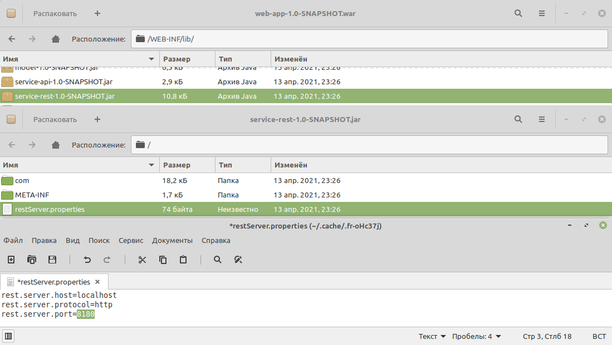

[](https://github.com/Brest-Java-Course-2021/dmilashuk-musicPlayer/actions/workflows/maven.yml)

# Music player test project

Technical task: [./documentation/Technical task.md](./documentation/Technical task.md).

Database structure: [./documentation/Database structure.pdf](./documentation/Database structure.pdf).
## Requirements

* JDK 11
* Apache Maven

## Build application:
```
mvn clean install
```
## Local tests with Jetty Maven Plugin
From the same directory as your root pom.xml, type:
```
mvn jetty:run
```
This starts Jetty and serves up your rest-app project on [http://localhost:8080](http://localhost:8080).
```
cd ./web-app; mvn jetty:run
```
This starts Jetty and serves up your web-app project on [http://localhost:8090](http://localhost:8090).
## Local tests with Postman
You can import postman collection: [./documentation/music player.postman_collection.json](./documentation/music%20player.postman_collection.json).

## Deploying project with Tomcat 9 on different ports

1. Open Tomcat folder
2. Open /conf/server.xml and add next configuration before </Service> tag

```
<Service name="server8180">
    <Connector port="8180" protocol="HTTP/1.1" connectionTimeout="20000" />
    <Engine name="Catalina1" defaultHost="localhost">
        <Host name="localhost"  appBase="server8180" unpackWARs="true" autoDeploy="true" />
    </Engine>
</Service>
<Service name="server8181">
    <Connector port="8181" protocol="HTTP/1.1" connectionTimeout="20000" />
    <Engine name="Catalina2" defaultHost="localhost">
        <Host name="localhost"  appBase="server8181" unpackWARs="true" autoDeploy="true" />
    </Engine>
</Service>
```
3. Inside the root tomcat folder create two new folders which names server8180 and 8181
4. Copy rest-app-1.0-SNAPSHOT.war into server8180 folder and web-app-1.0-SNAPSHOT.war into 8181 folder
5. Inside web-app-1.0-SNAPSHOT.war open /WEB-INF/classes/application.properties file and change the port number to 8180 

6. Rename rest-app-1.0-SNAPSHOT.war and web-app-1.0-SNAPSHOT.war to ROOT.war. Structure:


7. Run the following command in terminal from root tomcat folder to start server
```
cd ./bin; sh startup.sh
```
8. This starts Tomcat and serves up your rest-app project on [http://localhost:8180](http://localhost:8180) and your web-app project on [http://localhost:8180](http://localhost:8180).
9. Run the following command in terminal from root tomcat folder to stop server
```
cd ./bin; sh shutdown.sh
```  