# Музыкальный проигрыватель
Требуется Web приложение для хранения песен в плейлистах.
Приложение должно реализовывать следующие функции:
* Просмотр полного списка песен и его редактирование
* Просмотр списка плейлистов и его редактирование. Для каждого плейлиста указывается количество содержащихся в нем песен.
* Просмотр списка песен в плейлистах и его редактирование
* Должна быть реализована фильтрация списка песен по дате релиза
## 1.Плейлисты
## 1.1 Просмотр списка плейлистов
Данный режим программы предназначен для просмотра списка плейлистов с указание количество содержащихся в
них песен.
Основной сценарий:
* Пользователь выбирает пункт меню "playlists".
* Открывается форма просмотра всех плейлистов

В списке отображаются следующие колонки:
* Tittle - название плейлиста
* Count of songs - количество добавленных в плейлист песен

В форме просмотра списка плейлистов доступны кнопки:
* add - для добавления плейлиста
* delete - для удаления плейлиста
* edit - для редактирования плейлиста
* Songs - переход в режим просмотра списка песен
* Клик по названию в колонке "Tittle" - переход в режим просмотра плейлиста
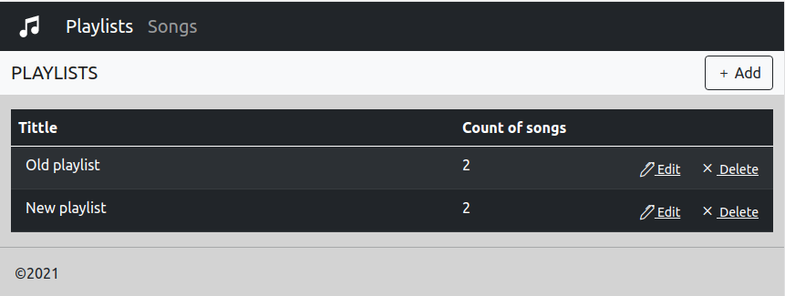
## 1.2 Добавление плейлиста
Основной сценарий:
* Находясь в форме просмотра списка плейлистов пользователь нажимает кнопку "add"
* Отображается форма добавления плейлиста
* Пользователь вводит данные и нажимает кнопку "save"
* Если данные сохранены успешно, то открывается форма просмотра списка плейлистов

В форме добавления плейлиста доступны кнопки:
* save - для добавления плейлиста
* cancel - для возврата к форме списка плейлистов
* <- - для возврата к форме списка плейлистов
* Songs - переход в режим просмотра списка песен
* Playlist - переход в режим просмотра плейлистов
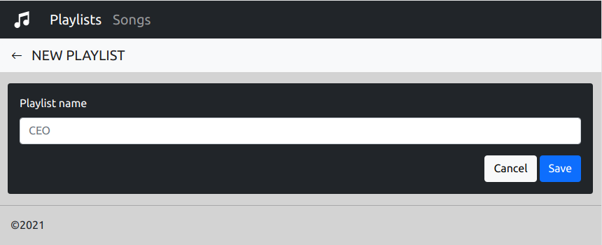
## 1.3 Редактирование плейлиста
Основной сценарий:
* Находясь в форме просмотра списка плейлистов пользователь нажимает кнопку "edit"
* Отображается форма редактирования плейлиста
* Пользователь вводит данные и нажимает кнопку "save"
* Если данные сохранены успешно, то открывается форма просмотра списка плейлистов

В форме редактирования плейлиста доступны кнопки:
* save - для сохранения редактирования плейлиста
* cancel - для возврата к форме списка плейлистов
* <- - для возврата к форме списка плейлистов
* Songs - переход в режим просмотра списка песен
* Playlist - переход в режим просмотра плейлистов
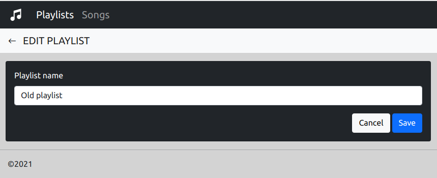
## 1.4 Удаление плейлиста
Основной сценарий
* Находясь в форме просмотра плейлистов пользователь нажимает кнопку «delete».
* Отображается форма удаления плейлиста
* Если пользователь нажимает кнопку «delete», то происходит удаление плейлиста, при этом песни которые в него
входили не удаляются
* Если удаление прошло успешно, то открывается форма просмотра списка плейлистов

В форме удаления плейлиста доступны кнопки:
* delete - для удаления плейлиста
* cancel - для возврата к форме списка плейлистов
* <- - для возврата к форме списка плейлистов
* Songs - переход в режим просмотра списка песен
* Playlist - переход в режим просмотра плейлистов
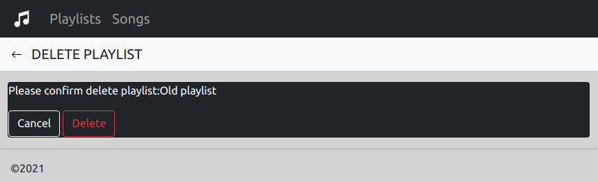
## 1.5 Просмотр плейлиста
Основной сценарий:
* Пользователь нажимает по названию плейлиста в колонке "Tittle"
* Отображается форма просмотра плейлиста

В форме просмотра плейлиста доступны кнопки:
* add song to playlist - для добавления песни в плейлист
* remove - для удаления песни из плейлиста, при этом в базе песня остается
* <- - для возврата в форму просмотра списка плейлистов
* Songs - переход в режим просмотра списка песен
* Playlist - переход в режим просмотра плейлистов
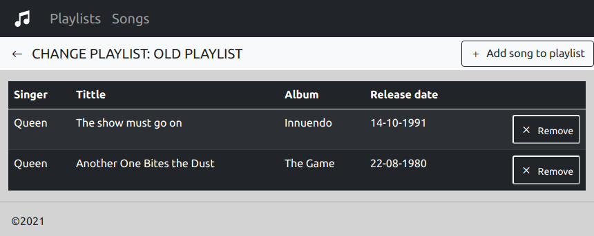
## 1.6 Добавление песни в плейлист
Основной сценарий:
* Пользователь нажимает на кнопку "add song to playlist" в форме просмотра плейлиста
* Отображается форма добавления песни в плейлист в которой содержатся все песни кроме уже имеющихся в
плейлисте
* Пользователь нажимает кнопку "add" напротив песни которую хочет добавить
* Если данные сохранены успешно, то открывается форма просмотра плейлиста

В форме добавления песни в плейлист доступны кнопки:
* add - для добавления песни в плейлист
* <- - для возврата в форму просмотра плейлиста
* Songs - переход в режим просмотра списка песен
* Playlist - переход в режим просмотра плейлистов
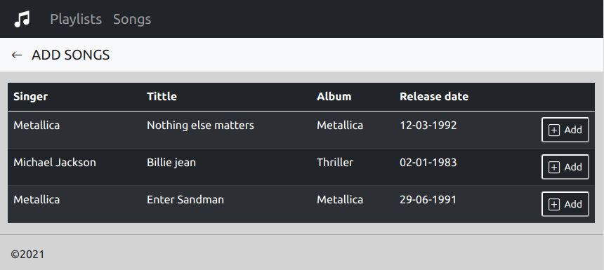
## 2 Песни
## 2.1 Просмотр списка песен
Данный режим программы предназначен для просмотра, и редактирования полного списка песен.
Основной сценарий:
* Пользователь выбирает пункт меню "songs".
* Открывается форма просмотра всех песен

В форме просмотра списка песен доступны кнопки:
* add - для добавления песни
* Filter - для фильтрации списка песен по дате релиза(допускается замена на значёк)
* delete - для удаления песни
* edit - для редактирования песни
* Songs - переход в режим просмотра списка песен
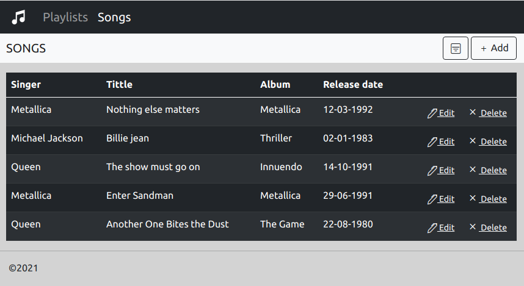
## 2.2 Добавление песни
Основной сценарий:
* Находясь в форме просмотра списка песен пользователь нажимает кнопку "add"
* Отображается форма добавления песни
* Пользователь вводит данные и нажимает кнопку "save"
* Если данные сохранены успешно, то открывается форма просмотра списка песен

В форме добавления песни доступны кнопки:
* save - для добавления песни
* cancel - для возврата к форме списка песен
* <- - для возврата к форме списка песен
* Songs - переход в режим просмотра списка песен
* Playlist - переход в режим просмотра плейлистов
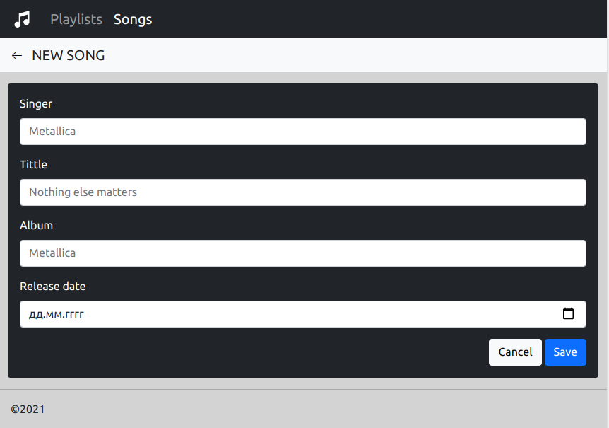

## 2.3 Редактирование песни
Основной сценарий:
* Находясь в форме просмотра списка песен пользователь нажимает кнопку "edit"
* Отображается форма редактирования песни
* Пользователь вводит данные и нажимает кнопку "save"
* Если данные сохранены успешно, то открывается форма просмотра списка песен

В форме редактирования песни доступны кнопки:
* save - для сохранения редактирования песни
* cancel - для возврата к форме списка песен
* <- - для возврата к форме списка песен
* Songs - переход в режим просмотра списка песен
* Playlist - переход в режим просмотра плейлистов
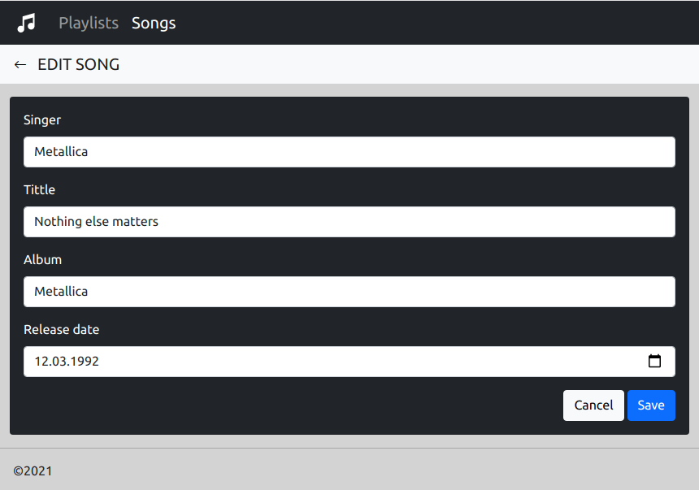
## 2.4 Удаление песни
Основной сценарий
* Находясь в форме просмотра списка песен пользователь нажимает кнопку "delete".
* Отображается форма удаления песни
* Если пользователь нажимает кнопку "delete", то происходит удаление песни
* Если удаление прошло успешно, то открывается форма просмотра списка песен

В форме удаления песни доступны кнопки:
* delete - для удаления песни
* cancel - для возврата к форме списка песен
* <- - для возврата к форме списка песен
* Songs - переход в режим просмотра списка песен
* Playlist - переход в режим просмотра плейлистов
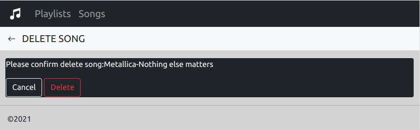
## 2.5 Фильтрация списка песен
Основной сценарий:
* Находясь в форме просмотра списка песен пользователь нажимает кнопку "filter" или соответствующий значёк
* Появляется окно ввода дат начала и конца периода фильтрации
* Если пользователь нажимает кнопку "Filter" происходит переход к отфильтрованному списку песен

В форме фильтрации списка песен доступны следующий кнопки:
* cancel - для возврата к форме списка песен
* filter - для выполнения фильтрации
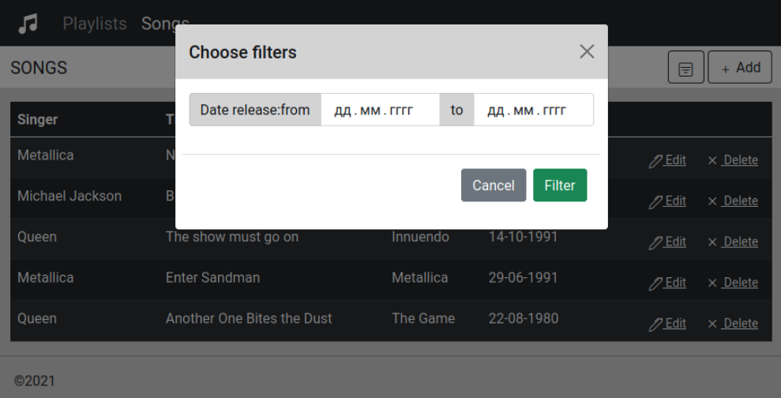

